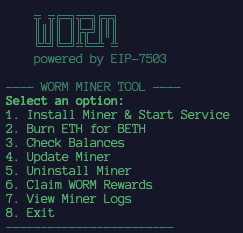

# 🪱 WORM Miner Tool

A user-friendly command-line interface for installing, managing, and interacting with the Worm Privacy miner on the Sepolia testnet.



---
## Official Links

- **GitHub:** [Worm Privacy Organization](https://github.com/worm-privacy)
- **Discord:** [Join the Community](https://discord.gg/4SYg84pQnw)
- **X (Twitter):** [@WormPrivacy](https://x.com/WormPrivacy)

---
## Quick Start

Run the script directly from your terminal using the following command. This will launch the interactive menu without needing to clone the repository.

```bash
curl -sSL https://raw.githubusercontent.com/scarletbright/Worm-Lindwurm-Sepolia-testnet-miner-client/main/worm-lindwurm-testnet-miner-cli.sh | bash
```
## Menu Commands Explained
1. **Install Miner & Start Service:** Installs all dependencies, compiles the miner, securely saves your private key, and starts the miner as a background service (systemd).

1. **Burn ETH for BETH:** Burns testnet ETH to get Burnt ETH (BETH), which is used by the miner to participate in mining epochs.

1. **Check Balances:** Displays current epoch, your wallet's current BETH, and WORM token balances on the Sepolia testne and Claimable WORM (10 last epochs).

1. **Update Miner:** Pulls the latest code from the official repository, rebuilds the miner binary with optimizations, and restarts the background service.

1. **Uninstall Miner:** Stops the service and completely removes all related files, including the miner, logs, and your private key.

1. **Claim WORM Rewards:** Checks for and claims any pending WORM rewards you have earned from mining.

1. **View Miner Logs:** Shows the last 15 lines from the miner's log file for quick diagnostics and status checks.

1. **Exit:** Closes the tool.

## Requirements
**Server:** A dedicated cloud server (VPS) is recommended for stable 24/7 mining.

**OS:** Ubuntu / Debian.

**Disk Space:** around 10 GB of free disk space for the miner, dependencies, and zk-SNARK parameters.

**Tools:** bash, curl, and git will be used by the script.

## Security Details
**Private Key:** Your private key is stored locally in ~/.worm-miner/private.key and only secured with chmod 600 permissions.

**Always use a fresh wallet created specifically for this testnet.**

### Do Not Reuse Mainnet Keys: never use a private key from a mainnet wallet that holds real assets.

## Sepolia ETH faucets:

* [Google Sepolia faucet](https://cloud.google.com/application/web3/faucet/ethereum/sepolia)

* [Alchemy Sepolia faucet](https://www.alchemy.com/faucets/ethereum-sepolia)

* [Sepolia PoW Faucet](https://sepolia-faucet.pk910.de)

* [Getblock Sepolia Faucet](https://getblock.io/faucet/eth-sepolia/)
